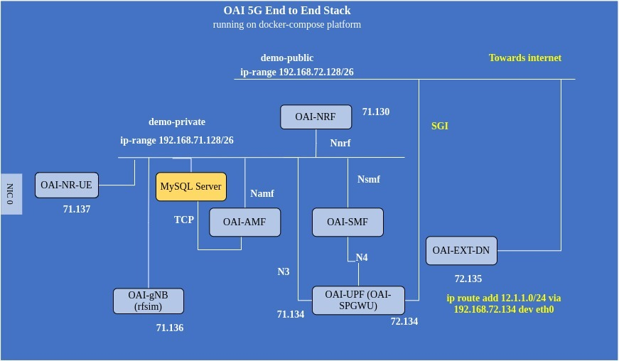

**TABLE OF CONTENTS**

1. [Retrieving the images on Docker-Hub](#1-retrieving-the-images-on-docker-hub)
2. [Deploy containers](#2-deploy-containers)
   1. [Deploy OAI 5G Core Network](#21-deploy-oai-5g-core-network)
   2. [Deploy OAI gNB in RF simulator mode and in Standalone Mode](#22-deploy-oai-gnb-in-rf-simulator-mode-and-in-standalone-mode)
   3. [Deploy OAI NR-UE in RF simulator mode and in Standalone Mode](#23-deploy-oai-nr-ue-in-rf-simulator-mode-and-in-standalone-mode)
3. [Check traffic](#3-check-traffic)
   1. [Check your Internet connectivity](#31-check-your-internet-connectivity)
   2. [Start the iperf server inside the NR-UE container](#32-start-the-iperf-server-inside-the-nr-ue-container)
   3. [Start the iperf client inside the ext-dn container](#33-start-the-iperf-client-inside-the-ext-dn-container)
4. [Un-deployment](#4-un-deployment)

# 1. Retrieving the images on Docker-Hub #

docker login

docker pull mysql:8.0

docker pull oaisoftwarealliance/oai-amf:latest
docker pull oaisoftwarealliance/oai-nrf:latest
docker pull oaisoftwarealliance/oai-smf:latest
docker pull oaisoftwarealliance/oai-spgwu-tiny:latest

docker pull oaisoftwarealliance/oai-gnb:develop
docker pull oaisoftwarealliance/oai-nr-ue:develop

docker images

# 2. Deploy containers #



## 2.1. Deploy OAI 5G Core Network ##

docker-compose up -d mysql oai-nrf oai-amf oai-smf oai-spgwu oai-ext-dn

Wait for a bit.

## 2.2 Deploy OAI gNB in RF simulator mode and in Standalone Mode

docker-compose up -d oai-gnb

Wait for a bit.

## 2.3 Deploy OAI NR-UE in RF simulator mode and in Standalone Mode

docker-compose up -d oai-nr-ue

Wait for a bit.

$ docker-compose ps -a
       Name                     Command                  State                  Ports            
-------------------------------------------------------------------------------------------------
rfsim5g-mysql        docker-entrypoint.sh mysqld      Up (healthy)   3306/tcp, 33060/tcp         
rfsim5g-oai-amf      /bin/bash /openair-amf/bin ...   Up (healthy)   38412/sctp, 80/tcp, 9090/tcp
rfsim5g-oai-ext-dn   /bin/bash -c  apt update;  ...   Up (healthy)                               
rfsim5g-oai-gnb      /opt/oai-gnb/bin/entrypoin ...   Up (healthy)                               
rfsim5g-oai-nr-ue    /opt/oai-nr-ue/bin/entrypo ...   Up (healthy)                               
rfsim5g-oai-nrf      /bin/bash /openair-nrf/bin ...   Up (healthy)   80/tcp, 9090/tcp            
rfsim5g-oai-smf      /bin/bash -c /openair-smf/ ...   Up (healthy)   80/tcp, 8805/udp, 9090/tcp  
rfsim5g-oai-spgwu    /openair-spgwu-tiny/bin/en ...   Up (healthy)   2152/udp, 8805/udp          
```

Making sure the OAI UE is connected:

```bash
$ docker exec -it rfsim5g-oai-nr-ue /bin/bash
root@bb4d400a832d:/opt/oai-nr-ue# ifconfig 
eth0: flags=4163<UP,BROADCAST,RUNNING,MULTICAST>  mtu 1500
        inet 192.168.71.137  netmask 255.255.255.192  broadcast 192.168.71.191
        ether 02:42:c0:a8:47:89  txqueuelen 0  (Ethernet)
        RX packets 224259  bytes 5821372018 (5.8 GB)
        RX errors 0  dropped 0  overruns 0  frame 0
        TX packets 235916  bytes 7848786376 (7.8 GB)
        TX errors 0  dropped 0 overruns 0  carrier 0  collisions 0

lo: flags=73<UP,LOOPBACK,RUNNING>  mtu 65536
        inet 127.0.0.1  netmask 255.0.0.0
        loop  txqueuelen 1000  (Local Loopback)
        RX packets 0  bytes 0 (0.0 B)
        RX errors 0  dropped 0  overruns 0  frame 0
        TX packets 0  bytes 0 (0.0 B)
        TX errors 0  dropped 0 overruns 0  carrier 0  collisions 0

oaitun_ue1: flags=4305<UP,POINTOPOINT,RUNNING,NOARP,MULTICAST>  mtu 1500
        inet 12.1.1.2  netmask 255.255.255.0  destination 12.1.1.2
        unspec 00-00-00-00-00-00-00-00-00-00-00-00-00-00-00-00  txqueuelen 500  (UNSPEC)
        RX packets 0  bytes 0 (0.0 B)
        RX errors 0  dropped 0  overruns 0  frame 0
        TX packets 0  bytes 0 (0.0 B)
        TX errors 0  dropped 0 overruns 0  carrier 0  collisions 0
```

## 3. Check traffic ##

## 3.1. Check your Internet connectivity ##

```bash
$ docker exec -it rfsim5g-oai-nr-ue /bin/bash
root@bb4d400a832d:/opt/oai-nr-ue# ping -I oaitun_ue1 -c 10 www.lemonde.fr
PING s2.shared.global.fastly.net (151.101.122.217) from 12.1.1.2 oaitun_ue1: 56(84) bytes of data.
64 bytes from 151.101.122.217 (151.101.122.217): icmp_seq=1 ttl=53 time=64.5 ms
64 bytes from 151.101.122.217 (151.101.122.217): icmp_seq=2 ttl=53 time=37.0 ms
64 bytes from 151.101.122.217 (151.101.122.217): icmp_seq=3 ttl=53 time=43.2 ms
64 bytes from 151.101.122.217 (151.101.122.217): icmp_seq=4 ttl=53 time=43.2 ms
64 bytes from 151.101.122.217 (151.101.122.217): icmp_seq=5 ttl=53 time=54.3 ms
64 bytes from 151.101.122.217 (151.101.122.217): icmp_seq=6 ttl=53 time=24.0 ms
64 bytes from 151.101.122.217 (151.101.122.217): icmp_seq=7 ttl=53 time=32.5 ms
64 bytes from 151.101.122.217 (151.101.122.217): icmp_seq=8 ttl=53 time=37.0 ms
64 bytes from 151.101.122.217 (151.101.122.217): icmp_seq=9 ttl=53 time=41.2 ms
64 bytes from 151.101.122.217 (151.101.122.217): icmp_seq=10 ttl=53 time=50.3 ms

--- s2.shared.global.fastly.net ping statistics ---
10 packets transmitted, 10 received, 0% packet loss, time 9011ms
rtt min/avg/max/mdev = 24.035/42.765/64.557/10.904 ms
```

If it does not work, certainly you need to modify the DNS values in the docker-compose.

But you can also check with the `ext-dn` container (IP address is `192.168.72.135` in docker-compose)

```bash
$ docker exec -it rfsim5g-oai-nr-ue /bin/bash
root@bb4d400a832d# ping -I oaitun_ue1 -c 2 192.168.72.135
PING 192.168.72.135 (192.168.72.135) from 12.1.1.2 oaitun_ue1: 56(84) bytes of data.
64 bytes from 192.168.72.135: icmp_seq=1 ttl=63 time=10.9 ms
64 bytes from 192.168.72.135: icmp_seq=2 ttl=63 time=16.5 ms

--- 192.168.72.135 ping statistics ---
2 packets transmitted, 2 received, 0% packet loss, time 1001ms
rtt min/avg/max/mdev = 10.939/13.747/16.556/2.810 ms
```

Let now try to check UDP traffic in Downlink.

You will need 2 terminals: one in the NR-UE container, one in the ext-dn container.

## 3.2. Start the `iperf` server inside the NR-UE container ##

```bash
$ docker exec -it rfsim5g-oai-nr-ue /bin/bash
root@bb4d400a832d:/opt/oai-nr-ue# iperf -B 12.1.1.2 -u -i 1 -s
------------------------------------------------------------
Server listening on UDP port 5001
Binding to local address 12.1.1.2
Receiving 1470 byte datagrams
UDP buffer size:  208 KByte (default)
------------------------------------------------------------
```

## 3.3. Start the `iperf` client inside the ext-dn container ##

```bash
$ docker exec -it rfsim5g-oai-ext-dn /bin/bash
root@f239e31a0bd0:/# iperf -c 12.1.1.2 -u -i 1 -t 20 -b 500K
------------------------------------------------------------
Client connecting to 12.1.1.2, UDP port 5001
Sending 1470 byte datagrams, IPG target: 22968.75 us (kalman adjust)
UDP buffer size:  208 KByte (default)
------------------------------------------------------------
[  3] local 192.168.72.135 port 58800 connected with 12.1.1.2 port 5001
[ ID] Interval       Transfer     Bandwidth
[  3]  0.0- 1.0 sec  64.6 KBytes   529 Kbits/sec
[  3]  1.0- 2.0 sec  63.2 KBytes   517 Kbits/sec
[  3]  2.0- 3.0 sec  61.7 KBytes   506 Kbits/sec
[  3]  3.0- 4.0 sec  63.2 KBytes   517 Kbits/sec
[  3]  4.0- 5.0 sec  61.7 KBytes   506 Kbits/sec
[  3]  5.0- 6.0 sec  63.2 KBytes   517 Kbits/sec
[  3]  6.0- 7.0 sec  61.7 KBytes   506 Kbits/sec
[  3]  7.0- 8.0 sec  63.2 KBytes   517 Kbits/sec
[  3]  8.0- 9.0 sec  61.7 KBytes   506 Kbits/sec
[  3]  9.0-10.0 sec  63.2 KBytes   517 Kbits/sec
[  3] 10.0-11.0 sec  61.7 KBytes   506 Kbits/sec
[  3] 11.0-12.0 sec  63.2 KBytes   517 Kbits/sec
[  3] 12.0-13.0 sec  61.7 KBytes   506 Kbits/sec
[  3] 13.0-14.0 sec  63.2 KBytes   517 Kbits/sec
[  3] 14.0-15.0 sec  63.2 KBytes   517 Kbits/sec
[  3] 15.0-16.0 sec  61.7 KBytes   506 Kbits/sec
[  3] 16.0-17.0 sec  63.2 KBytes   517 Kbits/sec
[  3] 17.0-18.0 sec  61.7 KBytes   506 Kbits/sec
[  3] 18.0-19.0 sec  63.2 KBytes   517 Kbits/sec
[  3] 19.0-20.0 sec  61.7 KBytes   506 Kbits/sec
[  3]  0.0-20.0 sec  1.22 MBytes   512 Kbits/sec
[  3] Sent 872 datagrams
[  3] Server Report:
[  3]  0.0-20.0 sec  1.22 MBytes   510 Kbits/sec   0.000 ms    3/  872 (0%)
```

Back on your NR-UE terminal you shall see:

```bash
[  3] local 12.1.1.2 port 5001 connected with 192.168.72.135 port 58800
[ ID] Interval       Transfer     Bandwidth        Jitter   Lost/Total Datagrams
[  3]  0.0- 1.0 sec  63.2 KBytes   517 Kbits/sec   1.113 ms    0/   44 (0%)
[  3]  1.0- 2.0 sec  61.7 KBytes   506 Kbits/sec   1.466 ms    0/   43 (0%)
[  3]  2.0- 3.0 sec  63.2 KBytes   517 Kbits/sec   1.770 ms    0/   44 (0%)
[  3]  3.0- 4.0 sec  61.7 KBytes   506 Kbits/sec   1.378 ms    0/   43 (0%)
[  3]  4.0- 5.0 sec  63.2 KBytes   517 Kbits/sec   1.614 ms    0/   44 (0%)
[  3]  5.0- 6.0 sec  63.2 KBytes   517 Kbits/sec   1.427 ms    0/   44 (0%)
[  3]  6.0- 7.0 sec  60.3 KBytes   494 Kbits/sec   1.507 ms    1/   43 (2.3%)
[  3]  7.0- 8.0 sec  63.2 KBytes   517 Kbits/sec   1.409 ms    0/   44 (0%)
[  3]  8.0- 9.0 sec  61.7 KBytes   506 Kbits/sec   1.525 ms    0/   43 (0%)
[  3]  9.0-10.0 sec  63.2 KBytes   517 Kbits/sec   1.393 ms    0/   44 (0%)
[  3] 10.0-11.0 sec  61.7 KBytes   506 Kbits/sec   1.377 ms    0/   43 (0%)
[  3] 11.0-12.0 sec  63.2 KBytes   517 Kbits/sec   1.501 ms    0/   44 (0%)
[  3] 12.0-13.0 sec  61.7 KBytes   506 Kbits/sec   1.788 ms    0/   43 (0%)
[  3] 13.0-14.0 sec  63.2 KBytes   517 Kbits/sec   1.466 ms    0/   44 (0%)
[  3] 14.0-15.0 sec  61.7 KBytes   506 Kbits/sec   1.381 ms    0/   43 (0%)
[  3] 15.0-16.0 sec  61.7 KBytes   506 Kbits/sec   1.417 ms    1/   44 (2.3%)
[  3] 16.0-17.0 sec  61.7 KBytes   506 Kbits/sec   1.569 ms    0/   43 (0%)
[  3] 17.0-18.0 sec  63.2 KBytes   517 Kbits/sec   1.492 ms    1/   45 (2.2%)
[  3] 18.0-19.0 sec  61.7 KBytes   506 Kbits/sec   1.376 ms    0/   43 (0%)
[  3] 19.0-20.0 sec  61.7 KBytes   506 Kbits/sec   1.589 ms    0/   43 (0%)
[  3]  0.0-20.0 sec  1.22 MBytes   510 Kbits/sec   1.551 ms    3/  872 (0.34%)
```

The `500 Kbits/sec` value may change depending on your CPU power!

# 4. Un-deployment #

```bash
$ docker-compose down
Stopping rfsim5g-oai-nr-ue  ... done
Stopping rfsim5g-oai-gnb    ... done
Stopping rfsim5g-oai-ext-dn ... done
Stopping rfsim5g-oai-smf    ... done
Stopping rfsim5g-oai-amf    ... done
Stopping rfsim5g-oai-spgwu  ... done
Stopping rfsim5g-oai-nrf    ... done
Stopping rfsim5g-mysql      ... done
Removing rfsim5g-oai-nr-ue  ... done
Removing rfsim5g-oai-gnb    ... done
Removing rfsim5g-oai-ext-dn ... done
Removing rfsim5g-oai-smf    ... done
Removing rfsim5g-oai-amf    ... done
Removing rfsim5g-oai-spgwu  ... done
Removing rfsim5g-oai-nrf    ... done
Removing rfsim5g-mysql      ... done
Removing network rfsim5g-oai-public-net
Removing network rfsim5g-oai-traffic_net-net
```
